- [WealthManager](#wealthmanager)
  - [Introduction](#introduction)
    - [High Level Architecture](#high-level-architecture)
    - [Project Structure](#project-structure)
    - [Use Cases Covered](#use-cases-covered)
      - [Investment related](#investment-related)
      - [User Management related](#user-management-related)
  - [Setting up the project](#setting-up-the-project)
  - [Running the project](#running-the-project)
  - [User Manual](#user-manual)
    - [Loging in](#loging-in)
    - [Adding investments](#adding-investments)
    - [User Management & Currency conversion](#user-management--currency-conversion)
  - [Addressing the Capstone Rubics](#addressing-the-capstone-rubics)
  - [Libraries Used](#libraries-used)
    - [CPPRestSDK](#cpprestsdk)
    - [Nlomaan Json](#nlomaan-json)
    - [QT Framework](#qt-framework)


# WealthManager
Personal wealth management system in C++

## Introduction 
* This project is implmented to manage personal finance mainly in investment domain. It provides a multi user system with multiple predefined currencies to work with.

### High Level Architecture
* A C++ client communicates with a C++ server using REST protocol. Data is transfered as JSON objects and persisted in the disk as files.
  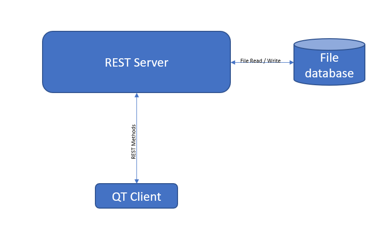
### Project Structure
* The project structure is as follows,
  ```
  WealthManager
  |--- 3rdParty
  |--- Common
  |--- QTClient
  |--- Server
  ```
* Each subfolder holds followings,
  * 3rdParty holds CPPRest Library and its dependencies.
  * Common hold the Data Transfer Objects and other common properties used by both client and server. This is built as a static library.
  * QTClient holds the GUI implementation.
  * Server holds the server implementation.
### Use Cases Covered
#### Investment related
* As a user, I want to store the amount of money with thier respective currencies that I hold in different banks.
* As a user, I want to store the amount of share market investments I have done in different instruments (ie. Equity, Bonds, Reits)
* As a user, I want to store the value of my properties (ie. Residential, Commercial, Land)
* As a user, I want to store other type of investments I have done.
* As a user, I want to have a consolidated overview of all of my current investments in USD.
* As a user, I want to maintain my financial activities in multiple currencies. (eg: United States Dollar, Singapore Dollar, Sri Lankan Rupee)
* As a user, I want to update the currency conversion rates.
  
#### User Management related
* As a user, I want to have authenticated access to my information. (Requiring user name & password before fetching user data)
* As a user, I want to create new users who can use this system. 
* As a user, I want to have an admin user which will be created by default with predefined username & password to initially login to the system. 
* As a user, I want to change my existing password.
## Setting up the project  
* Clone the repository while recursing submodules. Use command below.
  ```
  git clone https://github.com/ranadewa/WealthManager --recurse-submodules
  ```
* Build libraries in 3rd Party folder. Go into 3rd Party folder. Create a build directory and build the libraries. Please use the name **build** for the build directory. As it is included in Solutions' CMakeLists.txt file.
  ```
  cd 3rdParty
  mkdir build
  cd build
  cmake ..
  make
  ```
* Build source files. Start inside the WealthManager directory. ie ```/home/workspace/WealthManager```
  ```
  mkdir build
  cd build
  cmake ..
  make
  ```
## Running the project
* Two binaries will be created inside build directory when above is done.
  * Server Binary in : /home/workspace/WealthManager/build/Server/src/
  * Client binary in: /home/workspace/WealthManager/build/QTClient/Client/
* Go to Server binary path above. Run server:
  ```
    ./server 
  ```
* Go to Client binary path above. Run client:
  ```
  `./Client
  ```

## User Manual
### Loging in
* As instructed above, run server and client binaries.
* Once client binary is run. It will generate a login window as shown below.     
  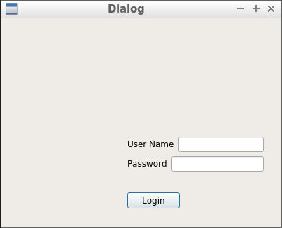
* For inital login use user name as **admin** & password as **123**. Password can be changed once logged in.   
* Once logged in ***Overview*** tab will be displayed.   
  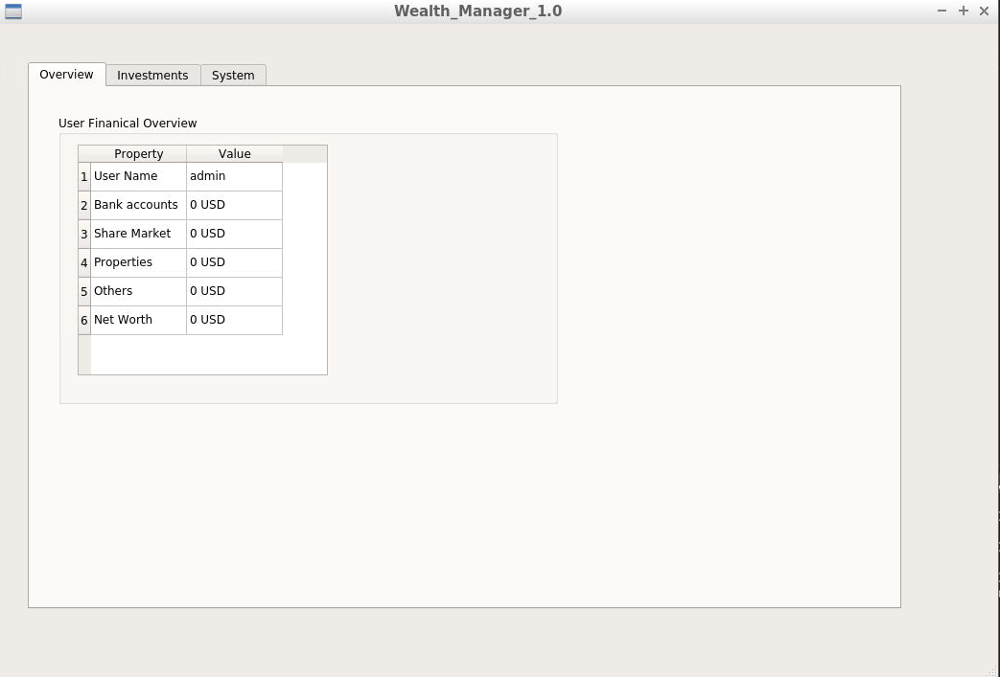
### Adding investments
* Click on ***Investments*** tab. Click on add new button.   
  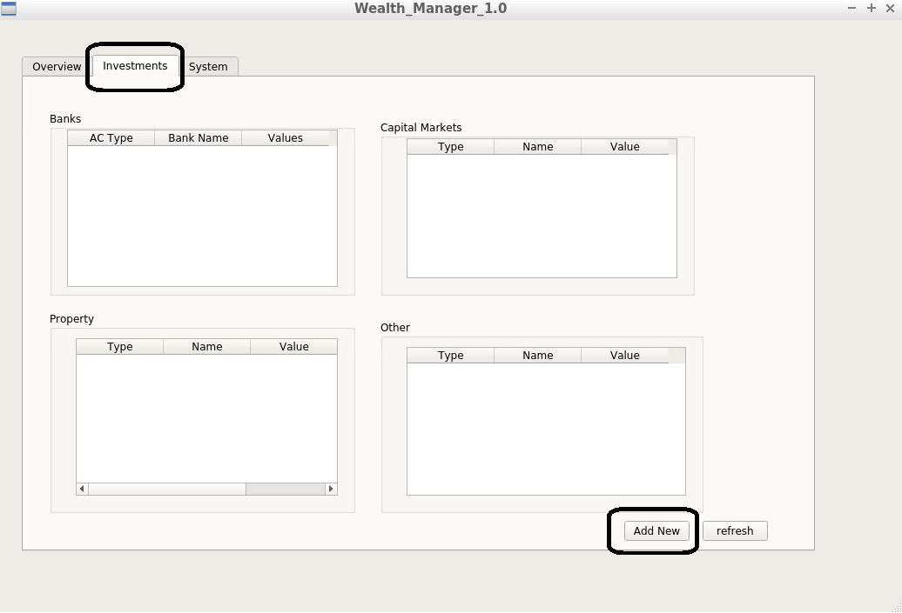
* A new dialog to add new investments will be displayed. Fill the neccessary information and click add button.   
  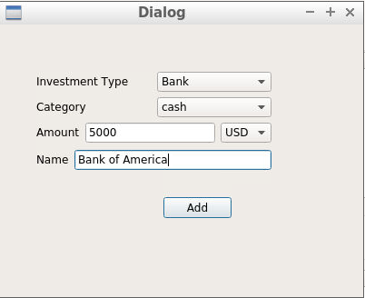 
* Confirmation dialog will be displayed. Click OK and focus will go back to Investments page. Then click refresh button in bottom right corner.   
  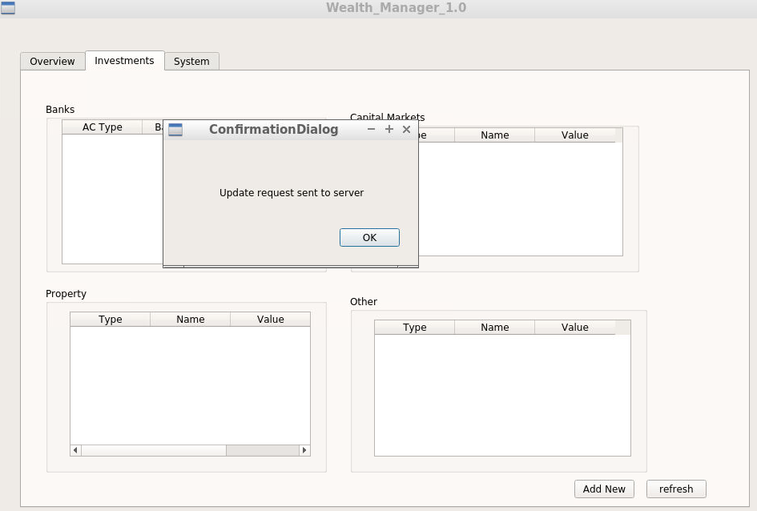
* The inserted information will be shown in the correct insvestment table.   
  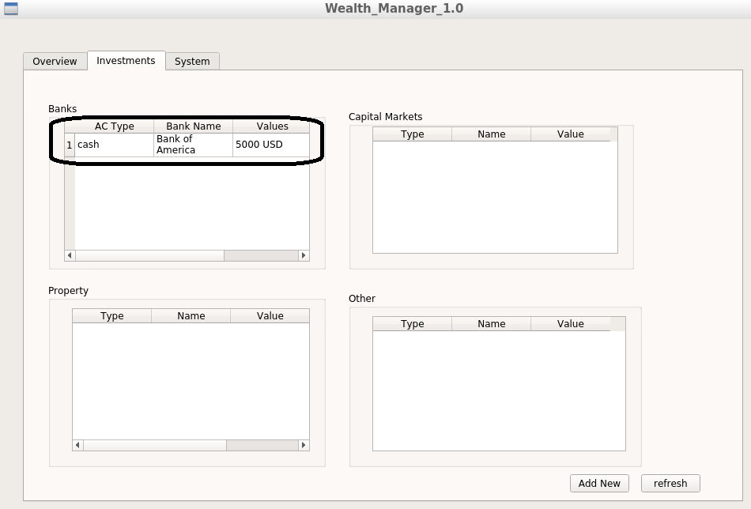
* As above add few different investments. Click refresh.   
  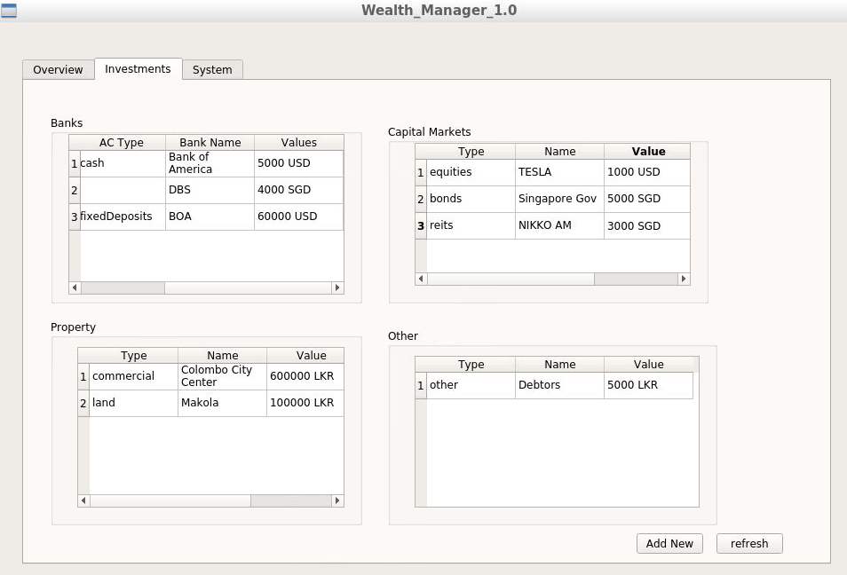
* Go to ***Overview*** tab. Now overview will be sources from updated information.   
  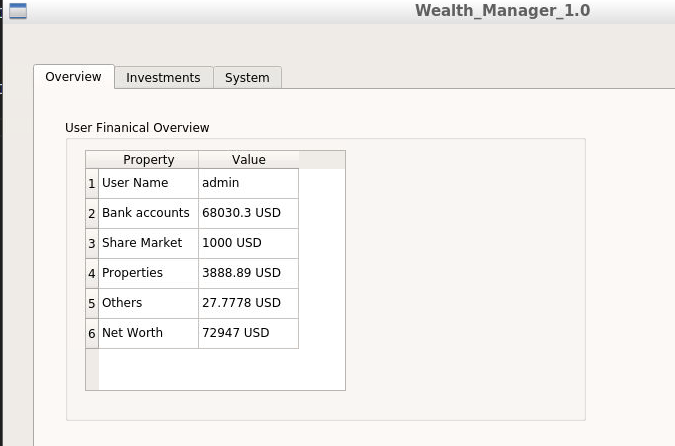
### User Management & Currency conversion
* Go to ***System*** tab. Click on add user button to add a user.   
  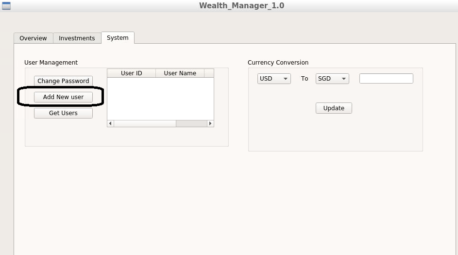
* A new user dialog is generated. Add necessary information and click ok.   
  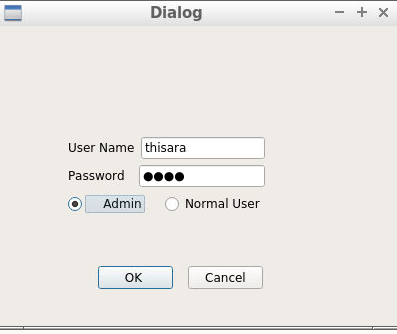
* Click Get Users button & all existing users will be listed in the table.   
  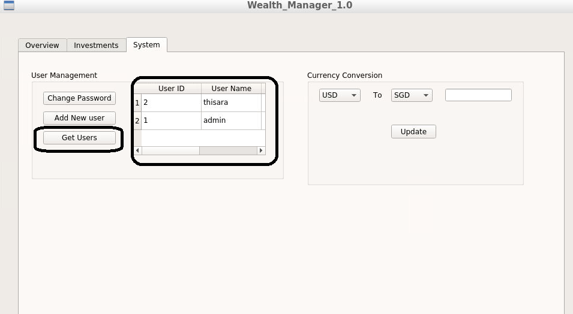
* To change logged in user's password, click Change Password button.    
  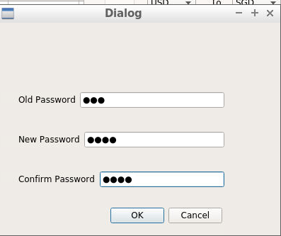
* To update currency conversion rates. Select respective currency from 2nd drop down in Currency conversion group and update it to correct value. Currently, only conversion from USD is supported. These rates will be used to calculate overview's total assets in USD.   
  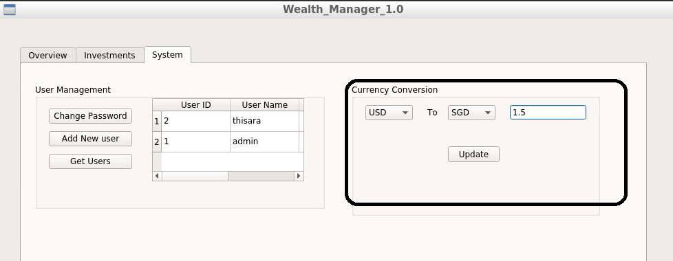
## Addressing the Capstone Rubics
| Crieteria | Examples |
|-----------| ---------|
| The project demonstrates an understanding of C++ functions and control structures. | refer [usermanager.h](https://github.com/ranadewa/WealthManager/blob/ubuntu_16.04/Server/src/usermanager.h) & [.cpp](https://github.com/ranadewa/WealthManager/blob/ubuntu_16.04/Server/src/usermanager.cpp) for use of functions and control sturctures. |
| The project reads data from a file and process the data, or the program writes data to a file. | refer [investmentrepository.cpp](https://github.com/ranadewa/WealthManager/blob/ubuntu_16.04/Server/src/investmentsrepository.cpp) line 15, line 37|
| The project accepts user input and processes the input. | refer [addnewuser.cpp](https://github.com/ranadewa/WealthManager/blob/ubuntu_16.04/QTClient/Client/addnewuser.cpp) AddNewUser::on_ok_clicked() function.|
|The project uses Object Oriented Programming techniques.| refer [HTTPServer Class](https://github.com/ranadewa/WealthManager/blob/ubuntu_16.04/Server/src/httpserver.h), [InvestmentManager Class](https://github.com/ranadewa/WealthManager/blob/ubuntu_16.04/Server/src/investmentsmanager.h)|
| Classes use appropriate access specifiers for class members.  | Same as above |
| Class constructors utilize member initialization lists. | refer [investmentmanager.cpp](https://github.com/ranadewa/WealthManager/blob/ubuntu_16.04/Server/src/investmentsmanager.cpp) constructor. |
| Classes abstract implementation details from their interfaces.| refer [IInvestmentRepository abstract class](https://github.com/ranadewa/WealthManager/blob/ubuntu_16.04/Server/src/investmentsrepository.h)| 
| Derived class functions override virtual base class functions.| refer [investmentrepository.h](https://github.com/ranadewa/WealthManager/blob/ubuntu_16.04/Server/src/investmentsrepository.h) line 26|
| Templates generalize functions in the project.| refer [investments.cpp](https://github.com/ranadewa/WealthManager/blob/ubuntu_16.04/Common/DTO/investments.cpp) transformToJson(std::vector input) function |
|The project makes use of references in function declarations.| refer [userrepository.h](https://github.com/ranadewa/WealthManager/blob/ubuntu_16.04/Server/src/userrepository.h) updateUsers(...) function & writeUser(...) |
|The project uses move semantics to move data, instead of copying it, where possible.| refer [investmentmanager.cpp](https://github.com/ranadewa/WealthManager/blob/ubuntu_16.04/Server/src/investmentsmanager.cpp) constructor|
| The project uses smart pointers instead of raw pointers. | refer [investmentrepository.h](https://github.com/ranadewa/WealthManager/blob/ubuntu_16.04/Server/src/investmentsrepository.h) unique_ptr usage|
|The project uses multithreading.| Refer [main.cpp](https://github.com/ranadewa/WealthManager/blob/ubuntu_16.04/Server/src/main.cpp) line 23|
|A mutex or lock is used in the project.| refer [httpserver.cpp](https://github.com/ranadewa/WealthManager/blob/ubuntu_16.04/Server/src/httpserver.cpp) registerEndpoint function.|

## Libraries Used
### [CPPRestSDK](https://github.com/microsoft/cpprestsdk#getting-started)
This is used to create a REST server with API defined. This library resides in 3rdParty folder.
### [Nlomaan Json](https://github.com/nlohmann/json)
This header only library is [copied to common folder](https://github.com/ranadewa/WealthManager/blob/ubuntu_16.04/Common/DTO/nlohmann/json.hpp) to create a static library along side solution defined Data Transfer Objects.
### [QT Framework](https://www.qt.io/product/development-tools)
QT is used to create the GUI of the client.
